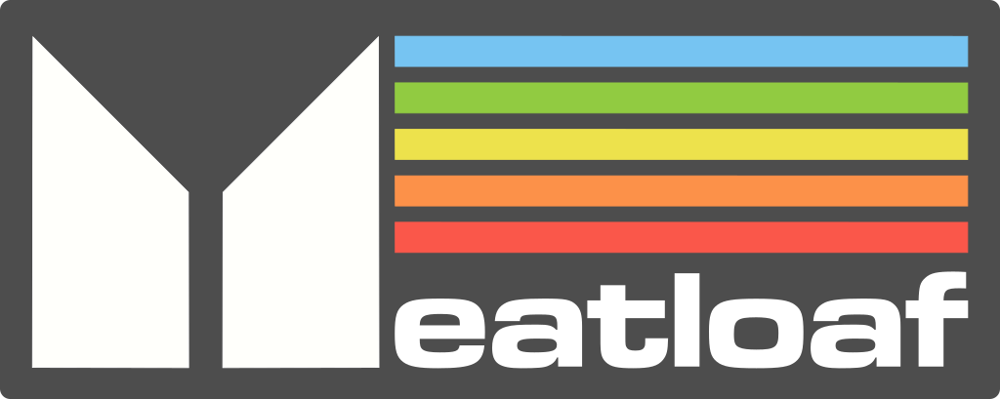

[](https://meatloaf.cc)

# What is Meatloaf?

"Meatloaf" for Commodore computers is not a game or software application. Instead, it's a hardware device designed to enhance the functionality of the classic computer. Here's what it does:

* **Emulates a floppy drive:** Meatloaf plugs into the Commodore 64's IEC serial port and acts like a virtual floppy drive. This allows you to load software and data stored on its internal flash memory, sd card, or stream it via WiFi using various protocols from servers all over the world.
* **Supports multiple virtual drives:** Unlike a single floppy drive, Meatloaf can be configured to emulate up to 26 virtual drives (IDs 4-30). Each virtual drive can have a different disk image loaded, essentially offering the equivalent of having thousands of floppies connected to your C64.
* **Supports additional virtual device types:** Printers, a network interface, and more.
* **Connects to the internet:** Meatloaf also functions as a WiFi modem, enabling your Commodore 64 to connect to Telnet BBS (bulletin board systems) for communication and sharing information.

Overall, Meatloaf is a valuable tool for Commodore enthusiasts as it provides a convenient and versatile way to load software, access a vast library of disk images, and connect to online communities, all without the need for physical floppy disks or additional hardware.

How is it even possible? Read more here: [Link](docs/howisitpossible.md)

Some Meatloaf code is used for the Commodore [FujiNet](https://github.com/FujiNetWIFI/fujinet-firmware) and some FujiNet code is also used in Meatloaf.<br/>
Meatloaf will remain focused on Commodore but the features that make sense will be merged into FujiNet.

## A cloud disk drive

While one can say Meatloaf is just another Commodore IEC Serial Floppy Drive similar to SD2IEC and its clones, Meatloaf is in fact much more than that, as it allows you to load not only local files stored on its internal flash file system or SD card, but also files from any URL you can imagine, straight into your Commodore computer without any additional software. For example you can load a game from some web server:

```BASIC
LOAD"HTTP://C64.MEATLOAF.CC/GAMES/H.E.R.O.PRG",8
```

Or from a D64 image on your own Windows/Samba server (all known CBM image formats supported):

```BASIC
LOAD"SMB://STORAGE/C64/FAVORITES/PIRATES/PIRATES_A.D64/*",8
```

Or even straight from a D64 image residing inside ZIP archive that is located somewhere on the Internet:

```BASIC
LOAD"HTTP://C64.MEATLOAF.CC/COLLECTION/BACKBIT/M/MARS SAGA.D81/START.PRG",8
```

## A NAS with WebDAV

If you rather keep your files locally, you can easily upload them to Meatloaf local file system via built-in WebDAV server. No need to shuffle SDCARD between your PC and Commodore!

## Select on your PC, load on your Commodore

By using "Send to Meatload" browser extension you can send programs to your Meatloaf and then load them easily from Basic, without typing the full URL. Just install a plugin in your browser:

[Chrome plugin](https://chromewebstore.google.com/detail/send-to-meatloaf/dofemlliemmbfmdbbjfpdaooaklfmdki)
[Firefox plugin](https://addons.mozilla.org/en-US/firefox/addon/send-to-meatloaf/)
[Opera plugin](https://addons.opera.com/en-gb/extensions/details/send-to-meatloaf/)

And on your Commodore just type below command to load whatever you tagged:

```BASIC
LOAD"ML:*",8
```

## The best network adapter for Commodore ever built!

Of course - any URL could be opened using Kernal or BASIC I/O commands like `OPEN`, `CLOSE`, `PRINT#`, `GET#` or `INPUT#`, meaning you don't need a modem or a network card with dedicated application anymore! Just open a byte stream via a TCP socket:

```BASIC
10 OPEN 1,8,1,"TCP://64VINTAGEBBS.DYNDNS.ORG"
```

Or via HTTP REST API:

```BASIC
10 OPEN 1,8,1,"HTTPS://API.OPENAI.COM/V1/COMPLETIONS"
```

And read/write into it like it was a file on a diskette!

But that's not all. Since Meatloaf has built-in JSON parser you can easily interact with web services straight from your BASIC v2, by just using `OPEN`, `PRINT#`, `INPUT#` and `GET#` and CBM-style dos commands to set HTTP headers and query JSON fields!

```BASIC
610 OPEN 15,8,15
611 OPEN 1,8,2,"HTTPS://API.OPENAI.COM/V1/CHAT/COMPLETIONS"
630 REM *** ADD REQUEST HEADERS
632 PRINT#15, "H+:CONTENT-TYPE:APPLICATION/JSON"
633 PRINT#15, "H+:AUTHORIZATION:BEARER "+KE$
```

Current internet enabled programs include:

- ISS tracking application
- Chuck Norris jokes client
- Terminal client
- You can find more internet apps using `LOAD"ML:$",8`

## Many devices in one

Meatloaf is not limited to be just your standard drive 8, you can configure it to respond to any number of Commodore-DOS devices, from 4 to 30, at the same time.

# Instructions

## Build and installation

[](https://www.youtube.com/watch?v=QXQjwKSVHjo)
CityXen! - https://www.youtube.com/watch?v=QXQjwKSVHjo


[Visual Studio Code](https://code.visualstudio.com/), and the
[PlatformIO IDE](https://marketplace.visualstudio.com/items?itemName=platformio.platformio-ide)
extension installed from the vscode store required.

1.  Initial setup & configuration
    1.  Clone this repo
    2.  Copy `platformio.ini.sample` to `platformio.ini`
    3.  Edit `platformio.ini` to match your device and default wifi settings:
        1. Find the `;environment = …` line for the dev board you have. Uncomment
           this line by removing the semicolon (;) at the beginning of the line.
        2. Determine how much flash memory your dev board has and uncomment the
           corresponding `;flash_size = …` line.
        4. Optionally, update the `wifi_ssid = "…"` and `wifi_pass = "…"`. To
           change these values from BASIC using the `OPEN` command, see
           [Using your Meatloaf](https://github.com/idolpx/meatloaf/wiki/Using-Your-Meatloaf#connect-to-your-wifi).
        5. If you're using a dev board that's not one of the documented ones,
           you may need to review and update other settings for your board.
           Consider creating a new environment file for your board.
2.  Load the project tasks for your specific board
    1.  Click the PlatformIO alien head on left panel
    2.  Under PROJECT TASKS, click on your specific board, for example `lolin d32 pro`
        - The board-specific project environment briefly expands with default tasks
        - Wait for the "PlatformIO: Loading tasks..." message at the bottom to go away
        - The board-specific project environment collapses automatically
    3.  Click on your specific board a second time
        - This time the section will remain expanded, with the correct tasks loaded
    
3.  Build & upload the filesystem image (this has to be done only once!)
    1.  Click the alien head on left panel
    2.  Under PROJECT TASKS, click on your specific board, for example `lolin d32 pro`
    3.  Click `Platform`, then `Build Filesystem Image`
    4.  Click `Platform`, then `Upload Filesystem Image`

4.  Build & Upload the firmware
    1.  Click the alien head on left panel
    2.  Under PROJECT TASKS, click on your specific board, for example `lolin d32 pro`
    3.  Click `General`, then `Upload and Monitor`
    3.  (It will take a while to compile and upload)

Meatloaf should now be running on the device!

## Getting a listing of a HTTP server

HTTP doesn't support listing files, but since for Commodore a directory is just a file you can `LOAD`, it's enough to add this tiny PHP script to your HTTP server to get a file listing as if you were reading a diskette!
All you need is some web space on a server with PHP enabled.
Just drop the following script in a directory with all your files and name it 'index.php'

[Meatloaf PHP Server Script](https://gist.github.com/idolpx/ab8874f8396b6fa0d89cc9bab1e4dee2)

Once that is done just you can get a directory listing on your C64 with Meatloaf with a standard LOAD command, as the script just serves `$` file formatted as BASIC v2 code.

```
LOAD"HTTP://YOURDOMAIN.COM/PATH",8
```

## And much more in the Wiki!

Please read the [Meatloaf Wiki](https://github.com/idolpx/meatloaf/wiki/Using-Your-Meatloaf) for more usage tips!

# Advanced documentation

Adding new file systems to Meatloaf: [Link](docs/filesystems.md)
