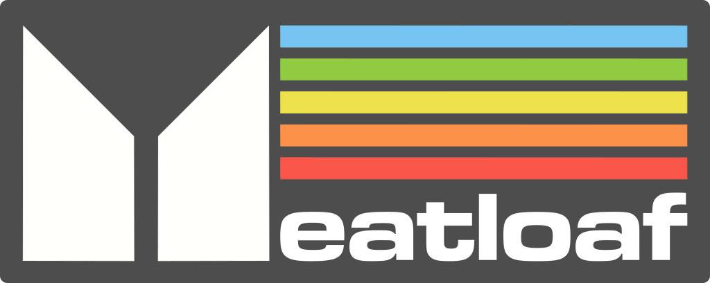

[](https://meatloaf.cc)

[](https://discord.gg/FwJUe8kQpS) &nbsp;
[](https://fb.meatloaf.cc) &nbsp;
[](https://yt.meatloaf.cc)

```diff
*** Be sure to use an ESP32-S3-WROOM-1-N16R8 dev module for all new builds!!!
*** The wiring is a little bit different but otherwise Deadline's video below is still great.
*** You can also flash using the web flasher instead of compiling the firmware yourself.
```

# What is Meatloaf?

Meatloaf is an ESP32 device that plugs into the IEC serial port of a Commodore 64, 128, VIC-20 or
Plus/4 and pretends to be a disk drive — but one whose "diskettes" can live on flash, on an SD card,
or on any server on the Internet.

* **It is a disk drive.** `LOAD"$",8` works. `LOAD"*",8` works. Your existing software does not know
  the difference.
* **Its disks can be anywhere.** A D64 on your NAS, a ZIP on a web server, a tape image on an FTP
  site — all addressed as ordinary filenames.
* **It is 26 drives at once.** Configure it to answer on any device IDs from 4 to 30 simultaneously,
  each with its own image mounted.
* **It is a network adapter.** Open a URL like a file. Talk to REST APIs from unmodified BASIC v2,
  with a JSON parser built into the drive.
* **It is also a printer, a clock, and a WiFi modem.** More devices in one cartridge-sized board than
  most people had on the whole bus.
* **It has a web app.** The **Meatloaf Manipulator** lets you search, browse and swap disks from a
  phone or laptop while the Commodore keeps running.

How is it even possible? Read more here: [Link](docs/howisitpossible.md)

Some Meatloaf code is used for the Commodore [FujiNet](https://github.com/FujiNetWIFI/fujinet-firmware)
and some FujiNet code is also used in Meatloaf.<br/>
Meatloaf will remain focused on Commodore but the features that make sense will be merged into FujiNet.

## A cloud disk drive

While one can say Meatloaf is just another Commodore IEC serial floppy drive similar to SD2IEC and
its clones, Meatloaf is in fact much more than that. It loads not only local files stored on its
internal flash file system or SD card, but files from any URL you can imagine, straight into your
Commodore without any additional software.

Load a game from a web server:

```BASIC
LOAD"HTTP://C64.MEATLOAF.CC/GAMES/H.E.R.O.PRG",8
```

Or from a D64 image on your own Windows/Samba server:

```BASIC
LOAD"SMB://STORAGE/C64/FAVORITES/PIRATES/PIRATES_A.D64/*",8
```

Or a single program out of a D81 sitting on a website:

```BASIC
LOAD"HTTP://C64.MEATLOAF.CC/COLLECTION/BACKBIT/M/MARS SAGA.D81/START.PRG",8
```

### Nested URLs — the trick that makes all of it work

A Meatloaf path is parsed **right to left**, and every component can be a container. So a disk image
inside a ZIP archive on a remote server is just a longer filename:

```BASIC
LOAD"HTTP://SERVER.COM/FILES/GAME.ZIP/DISK.D64/START.PRG",8
```

That resolves to `FileStream(D64Stream(ZipStream(HttpStream)))` — the ZIP is decompressed on the fly,
the D64's directory is read out of the decompressed bytes, and the PRG is streamed to your C64. No
unpacking step, no temporary files, nothing to copy to an SD card first. It composes to any depth and
works over every protocol below.

## Supported media formats

Anything in this list can be listed with `LOAD"$",8`, navigated into with `CD`, and loaded from — on
flash, on SD, or over any of the network protocols in the next section.

### CBM disk images

| Extension | Format |
|---|---|
| `.d64` `.d41` | 1541 (35/40/42 track) |
| `.d71` | 1571 |
| `.d81` | 1581 |
| `.d80` | 8050 |
| `.d82` | 8250 |
| `.dnp` | CMD native partition |
| `.d1m` `.d2m` `.d4m` | CMD FD2000 / FD4000 |
| `.dhd` | CMD HD (partition table, `CP<n>` partition switching) |
| `.hdd` | IDE64 CFS hard disk |
| `.d90` `.d60` `.d96` | Commodore D9060 / D9090 hard disk |
| `.m2i` | MMC2IEC / sd2iec text index |
| `.d8b` | BackBit |
| `.dfi` | DreamLoad File Archive |

`N:` format produces a valid image for all six of D64/D71/D80/D81/D82/DNP. `SAVE`, `S:` scratch and
unscratch work inside D64, D71, D81, DNP and CMD HD partitions — with real CBM block allocation,
file and directory interleave, BAM updates per block, rollback and `72,DISK FULL` on overflow.

### Flux and bit-level disk images

For the copy-protected originals a sector image cannot hold.

| Extension | Format |
|---|---|
| `.g64` `.g41` | GCR bitstream, 1541 |
| `.g71` | GCR bitstream, 1571 |
| `.g81` | MFM bitstream, 1581 |
| `.nib` `.nb2` `.nbz` | NIBtools raw GCR |
| `.p64` | Flux transitions, 1541 |
| `.p81` | Flux transitions, 1581 |

`.p64`/`.p81` are decoded from raw magnetic flux, one track at a time, on the ESP32 — pulses to GCR
or MFM bitstream to CBM sectors, including the rotation seam. Read-only.

### Tape images

| Extension | Format |
|---|---|
| `.tap` `.dmp` `.htap` | Datasette pulse images (TAP v0/v1/v2, DC2N DMP, Manosoft HTAP) |
| `.t64` | Tape archive |
| `.tcrt` | Tapecart file system |
| `.csm` | Block-level tape image |

Tape images are decoded by a vendored TAPClean engine with roughly **90 loader scanners** —
Cyberload, Visiload, US Gold, Novaload, Freeload, Turbo Tape 64 and many more. Every program on the tape is extracted, turbo-loader boot stubs are folded into their
payloads so the listing shows game names rather than loader stubs, and the tape behaves like a real
datasette (one entry per request, rewind at the end). Write a `.idx` sidecar with the `T-I` command
and it becomes a random-access directory instead.

### Commodore archives and containers

| Extension | Format |
|---|---|
| `.arc` `.sda` | ARC / self-dissolving ARC (all six compression modes) |
| `.ark` | ARK |
| `.lnx` | Lynx |
| `.lbr` | LiBRary |
| `.spy` | SPYne self-extracting container |
| `.wra` `.wr3` | Wraptor 1/2/3 (LZSS) |
| `.p00` `.s00` `.r00` `.c64` | PC64 / CCS64 single-file containers |

### Modern archives

Handled by libarchive, and freely nestable with everything above.

| Kind | Extensions |
|---|---|
| Archives | `.zip` `.jar` `.rp9` `.rar` `.7z`\* `.tar` `.cpio` `.lha` `.lzh` `.sfx` `.iso` |
| Compressed files | `.gz` `.bz2` `.xz` `.lz` `.z` `.zst` `.lz4` |
| Compressed tarballs | `.tgz` `.tar.gz` `.tar.bz2` `.tar.xz` `.tar.lz` `.tar.z` `.tar.zst` `.tar.lz4` `.cpgz` |

\* `.7z` uses LZMA, whose dictionary does not fit comfortably in ESP32 RAM — listing works, extraction
of large entries may not.

The reader is selected by extension rather than by content probing, because bidding across every
format costs tens of kilobytes of reads — about 180 network round trips before the first entry on a
slow HTTP source. An unrecognised extension still falls back to probing.

Meatloaf carries local fixes to libarchive's LHA reader so Commodore `.sfx` self-extractors and Amiga
level-1 `.lha` archives — both of which stock libarchive refuses — read correctly, along with a full
`-lh1-` (LHarc 1.x adaptive Huffman) decoder.

## Network protocols

### Mount and load directly from the drive

Every scheme below can appear anywhere in a path, including as the bottom of a nested URL.

| Scheme | Protocol |
|---|---|
| `http://` `https://` | Web servers, with TLS |
| `ftp://` `ftps://` | FTP, with opportunistic or explicit TLS |
| `sftp://` | SSH file transfer |
| `smb://` | Windows / Samba shares |
| `nfs://` | NFSv3 |
| `afp://` † | Apple Filing Protocol |
| `tnfs://` | TNFS (FujiNet) |
| `fsp://` | FSP |
| `iscsi://` † | iSCSI block devices |

† Off in the default build or still in development — see [What your board actually gets](#what-your-board-actually-gets).

Plus service and device schemes: `ml:` (the Meatloaf server), `mdns://` (browse the services on your
LAN as a directory), `mqtt://`, `i2c://`, and `sd:`.

And transform prefixes that turn a stream into something else on the way out: `json:` (query a JSON
document by path), `qr:` (render a QR code), `hash:` (checksum a stream), `csip:` (Commodore Server),
`retropixels:` † (convert a modern image to a C64 picture format).

### Raw sockets from BASIC

TCP, UDP, Telnet, SSH and more live on the network device (device 16), FujiNet-compatible:

| Protocol | Notes |
|---|---|
| `TCP` `UDP` | Raw sockets, client and server |
| `TELNET` | With terminal negotiation — dial a BBS |
| `HTTP` `HTTPS` | Full verb set, headers, JSON |
| `FTP` `TNFS` `SMB` `SSH` `SD` | Directory-capable protocols |

## Fast loaders

A stock 1541 moves about 300 bytes per second. Meatloaf speaks the protocols that fixed that.

**Hardware and cartridge loaders**, on every board: CBM Fast Serial (C128 burst), **JiffyDOS**, Epyx
FastLoad, Final Cartridge 3, Action Replay 6.

**Parallel loaders**, on boards wired for a parallel cable: DolphinDOS, SpeedDOS, IEEE-488, WiC64. (Still in development)

**Software loaders** — the ones a game uploads into the drive's RAM with `M-W` and starts with `M-E`.
Meatloaf recognises **65 uploaded routines across 19 families** by CRC of the uploaded code, the same
detection table sd2iec uses:

> Hypra-Load · Turbodisk · DreamLoad · ULoad Model 3 · GI Joe · GEOS · Wheels · Nippon · ELoad 1 ·
> Maniac Mansion / Zak McKracken · N0SDOS · Sam's Journey · Ultraboot · **Krill** (r58–r192) ·
> **Booze Design** · **Spindle** 2.1–3.x · **Bitfire** 0.1–1.3 · **Sparkle** 1.0–3.2 · Transwarp

That covers the loaders behind most of the modern demoscene as well as the classics. A recognised
loader that a given board does not have room to implement is logged and cleanly declined, so the
computer falls back to the standard protocol instead of hanging.

> **Status:** Epyx, Final Cartridge 3, Action Replay 6, Hypra-Load and SpeedDOS run through the
> hardware-proven signature matcher in the bus handler. The rest of the software-loader layer is
> brand new — detection tables and transfer code are written and building on every board, but have
> not yet been driven from a real C64. Expect rough edges, and please report what you find.

## Meatloaf Manipulator — swap disks from any screen in the house

Point a browser at your Meatloaf and you get the **Meatloaf Manipulator**, the web interface for
running the device while your Commodore stays switched on:

* **Swap disks live.** Mount an image to any drive ID and change it under the running machine, the
  way you would flip a floppy — except the floppy can be on the SD card, in flash, or on a server on
  the other side of the world.
* **Search your whole collection.** Query the full-text index of the SD card built by `updatedb`,
  and find a program by name across tens of thousands of files.
* **Browse the archives of the world.** Walk remote collections over HTTP, FTP, SMB and the rest,
  descend into ZIPs and disk images as if they were folders, and mount what you find — all without
  downloading anything first.
* **Configure everything.** WiFi, device IDs, per-drive settings, firmware updates.

It is a progressive web app, so it installs to the home screen of a phone or tablet and runs
standalone. Keep it open on the couch next to the C64 and never get up to change a disk again.

## A NAS with WebDAV

If you would rather keep your files local, upload them to Meatloaf's own file system through its
built-in **WebDAV server**. Mount it as a network drive in Windows, macOS or Linux and drag disk
images straight onto your Meatloaf's storage. No shuffling the SD card between machines.

The same web server also carries an HTTP proxy endpoint (so the Manipulator can reach CORS-restricted
sites) and a WebSocket activity feed that pushes device events to the UI as they happen.

## A real shell on the drive

Meatloaf has a console — over USB serial, or over TCP from anywhere on your network — with the
commands you would expect and several you would not:

* `ls` `cd` `cat` `hex` `cp` `mv` `rm` `mkdir` — all of which work **inside disk images and archives**
  and **over the network**, because they go through the same stream layer the C64 does.
* `mount`, `partition`, `df`, `wget`, `gzip`, `unzipx`, `crc32`
* `updatedb` and `locate` — build a SQLite full-text index of your entire SD card and find any file
  on it instantly.
* `use` and `exec` — point the console at a drive and send it raw CBM DOS commands. Drive the whole
  IEC device from a terminal with no Commodore attached.
* `open` / `read` / `write` / `close` / `channels` — open a file channel on the drive by secondary
  address and move bytes through it, exactly as a C64 would.

## Short codes — a whole URL in a few characters

Nested URLs are powerful, but nobody wants to type

```
LOAD"HTTP://SERVER.COM/COLLECTIONS/DEMOS/1991/PARTY.ZIP/DISK.D64/START.PRG",8
```

on a C64 keyboard — let alone read it down the phone to a friend. **Meatloaf Short Codes** stand in
for any URL, however long:

```BASIC
LOAD"ML:HERO",8
```

Create a profile at **[meatloaf.cc/sc](https://meatloaf.cc/sc)** and register your own. The `ML:`
service looks the code up and redirects to the full URL, so a short code works anywhere a URL does. (HTTP/FTP/TNFS/etc)

Anything you put after the code is passed straight through, so a code can name a container and you
still walk into it the usual way:

```BASIC
LOAD"ML:DEMOS/DISK.D64/START.PRG",8
```

Short enough for a forum post, a tweet, a video caption, or a label on the disk box — and if the file
ever moves, you repoint the code instead of reprinting the label.

## Select on your PC, load on your Commodore

With the "Send to Meatloaf" browser extension you can send programs to your Meatloaf and then load
them from BASIC without typing the full URL. Install the extension:

[Chrome plugin](https://chromewebstore.google.com/detail/send-to-meatloaf/dofemlliemmbfmdbbjfpdaooaklfmdki)
[Firefox plugin](https://addons.mozilla.org/en-US/firefox/addon/send-to-meatloaf/)
[Opera plugin](https://addons.opera.com/en-gb/extensions/details/send-to-meatloaf/)
[Microsoft Edge](https://microsoftedge.microsoft.com/addons/detail/send-to-meatloaf/lldmcophddipeonfdpjacidbhadfcenj)

A **"Send to Meatloaf" mobile app for Android and iOS is in development**, so you will be able to
share a link straight from your phone's browser to the Commodore in the next room.

Then on your Commodore just type:

```BASIC
LOAD"ML:*",8
```

## The best network adapter for Commodore ever built

Any URL can be opened with the ordinary Kernal or BASIC I/O commands — `OPEN`, `CLOSE`, `PRINT#`,
`GET#`, `INPUT#`. You do not need a modem or a network card with dedicated software. A URL on a data
channel is just a file you read:

```BASIC
10 OPEN 1,8,3,"HTTPS://EXAMPLE.COM/HELLO.TXT"
20 GET#1,A$ : PRINT A$; : IF ST=0 THEN 20
30 CLOSE 1
```

Open the same device on **secondary address 2** instead and it becomes a full HTTP client that takes
orders line by line — pick the verb, set headers, attach a body, send, and pull fields straight out
of the JSON response with the **built-in JSON parser**:

```BASIC
10 OPEN 1,8,2,"HTTPS://API.EXAMPLE.COM/V1/THINGS"
20 PRINT#1,"H ACCEPT: APPLICATION/JSON"
30 PRINT#1,"M GET"
40 PRINT#1,"S"
50 PRINT#1,"J /ITEMS/0/NAME"
60 INPUT#1,N$ : PRINT N$
70 CLOSE 1
```

No driver to install, no library to link, no wedge. That is a REST client in seven lines of
unmodified BASIC v2.

Find internet apps with `LOAD"ML:$",8` — an ISS tracker, a Chuck Norris joke client, a terminal, and
more.

[See how easy it is to access APIs from BASIC v2](https://github.com/ssuukk/meatloaf_examples):

* **swapi_bc64.bas** — Star Wars API Explorer (bc64 BASIC). Browse people, planets, films, species,
  vehicles and starships from swapi.dev with paginated lists and detail views.
* **wikipedia_bc64.bas** — Wikipedia Article Browser (bc64 BASIC). Fetch article summaries via the
  Wikimedia REST API — search, random, or lookup by name.
* **sky_watcher_bc64.bas** — ADS-B Aircraft Tracker (bc64 BASIC). Live air traffic data from adsb.fi:
  find flights by callsign or hex code, list military aircraft, scan airspace near airports.
* **openai_bc64.bas** — OpenAI / Ollama Chat Client (bc64 BASIC). Interactive chatbot with
  conversation history, JSON body construction, and streaming response display.
* **c64-chat-client-c/** — Full C Chat Client (cc65). Screen-editor input, conversation history,
  runtime configuration, PETSCII-aware JSON generation.

The full command language is documented in
[docs/meatloaf-networking.md](docs/meatloaf-networking.md) — it is the same protocol whether your
client is BASIC, C or assembly.

## Many devices in one

Meatloaf is not limited to being your drive 8. Configure it to answer as any number of Commodore DOS
devices from 4 to 30 at the same time — several drives, plus:

* **Printer** on device 4 — MPS-803 emulation today, with Epson, Okimate 10, Epson PrintShop and
  raw/ASCII/PNG/HTML capture drivers in the tree.
* **Real-time clock** on device 29 — `T-R` / `T-W` / `T-Z`, with IANA timezone names and DST.
* **Network device** on device 16 — the raw socket and protocol adapter described above,
  FujiNet-compatible.
* **Meatloaf control device** on device 30 — mount images, query status, drive the box from BASIC.
* **Modem** — Zimodem-compatible WiFi modem for telnet BBSing (build option - needs work).
* **WiC64** — WiC64 protocol compatibility (needs a parallel-wired board - needs work).
* **FujiNet** — a FujiNet compatibility layer, so FujiNet software works here too.

# Instructions

## Ingredients

Three parts. About **$15** all in, and the plugs and wire make **five** IEC pigtails — one for you
and four for your friends.

| Qty | Part | Price | Where |
|---|---|---|---|
| 1 | **ESP32-S3-WROOM-1-N16R8** dev module | $4.48 | [AliExpress](https://www.aliexpress.us/item/3256809024494642.html) |
| 5 | 6-pin DIN male plug | $3.21 | [AliExpress](https://www.aliexpress.us/item/3256805997791683.html) |
| 2 m | 24 AWG 6-core sheathed wire | $7.32 | [AliExpress](https://www.aliexpress.us/item/3256812182521208.html) |

Solder the wire between a DIN plug and the dev module, flash the firmware, and you have a Meatloaf.
No PCB to order, no surface-mount work, no enclosure required (but there are some in the repo to 3D print).

### Bake it on the S3

**Use the ESP32-S3-WROOM-1-N16R8 for every new build.** The Lolin D32 Pro has served Meatloaf well
and existing boards keep working — every format and every fast loader is available on both. The S3
simply does all of it faster, and leaves room for what comes next.

| | Lolin D32 Pro (ESP32-WROVER) | ESP32-S3-WROOM-1-N16R8 |
|---|---|---|
| PSRAM | 8 MB, quad SPI at 40 MHz | **8 MB, octal SPI at 80 MHz** — four times the bandwidth |
| Flash-text window | 3,342,304 bytes, and Meatloaf nearly fills it | far larger — plenty of margin |
| IRAM headroom | a few KB | **~24 KB** |
| PSRAM cache erratum workaround | mandatory, costs ~18 KB of IRAM | not needed |
| USB | separate USB-serial chip | **native USB-Serial-JTAG** |

What that buys you in practice:

* **Faster heavy decoding.** Tape scanning, `.p64`/`.p81` flux decoding and Wraptor extraction all
  work out of PSRAM and are bandwidth-bound — the octal bus at double the clock is where they get
  their speed.
* **Twice the PSRAM.** 8 MB immediately available instead of 4 + 4 banked, so bigger tapes, bigger archives and deeper nested URLs
  before anything has to spill.
* **Room to grow.** Meatloaf is close to the older chip's flash and IRAM limits. On the S3 there is
  margin for everything still to come.
* **Plug it in and it just talks.** Native USB means the 2 Mbps console works out of the box, with no
  CP2102 to cap you at 1 Mbps.
* **No silicon workaround tax.** The original ESP32's PSRAM cache erratum costs about 18 KB of IRAM
  on every build. The S3 does not have it.

Wiring is a little different from the older board, but Deadline's video below is otherwise still
valid — and you never have to compile anything, because
**[flash.meatloaf.cc](https://flash.meatloaf.cc)** installs the firmware straight from your browser.

# Baking Your Meatloaf!

### Have Deadline show you how

[](https://www.youtube.com/watch?v=QXQjwKSVHjo)
CityXen! - https://www.youtube.com/watch?v=QXQjwKSVHjo

See also the [Build Meatloaf](https://github.com/idolpx/meatloaf/wiki/Build-Meatloaf) wiki page for
wiring detail.

## Installing the firmware

### You do not have to compile anything

Open **[flash.meatloaf.cc](https://flash.meatloaf.cc)** in Chrome, Brave, or Edge, plug the Meatloaf into a USB
port, and click "Connect", select a previous firmware if you'd like then "Bake Meatloaf!". That is the whole procedure — a current, tested build lands on your device
in about a minute. No toolchain, no clone, no compiler, nothing to configure first.

Connect to WiFi afterwards from the serial terminal that pops up or from BASIC.


### Building it yourself

Only needed if you are bringing up an undocumented board, changing which features are compiled in, or
working on Meatloaf itself: **[Building the firmware](docs/building-firmware.md)**.

## What your board actually gets

The format and protocol lists above describe a default build, which is what the web flasher installs
— every format and every fast loader, on ESP32 and ESP32-S3 alike. Two things still vary by board:

* **`MIN_CONFIG` boards** — the small-flash ESP32-WROOM32 class, with no PSRAM — are the exception.
  They drop the archive layer, the tape engine, SMB/SFTP/NFS/AFP, the flux and CMD/IDE64 image
  formats, and the JSON/QR/hash transforms. The CBM disk images, HTTP/FTP/TNFS/FSP and the fast
  loaders all stay.
* **PSRAM matters.** Tape decoding, `.p64`/`.p81` flux decoding, Wraptor extraction and FTPS all
  want it, whatever the board.

If you are compiling your own and need to trade a feature for flash space, every switch is listed
with what it costs in
[Building the firmware § Feature gates](docs/building-firmware.md#feature-gates).

## Getting a listing of a HTTP server

HTTP doesn't support listing files, but since for Commodore a directory is just a file you can
`LOAD`, it's enough to add this tiny PHP script to your HTTP server to get a file listing as if you
were reading a diskette! All you need is some web space on a server with PHP enabled. Just drop the
following script in a directory with all your files and name it `index.php`:

[Meatloaf PHP Server Script](https://gist.github.com/idolpx/ab8874f8396b6fa0d89cc9bab1e4dee2)

Once that is done you can get a directory listing on your Commodore with a standard LOAD command, as
the script serves the `$` file formatted as BASIC v2 code.

```
LOAD"HTTP://YOURDOMAIN.COM/PATH",8
```

## And much more in the Wiki!

Please read the [Meatloaf Wiki](https://github.com/idolpx/meatloaf/wiki/Using-Your-Meatloaf) for more
usage tips!

# Advanced documentation

Building the firmware from source, and every feature gate: [Link](docs/building-firmware.md)

Adding new file systems to Meatloaf: [Link](docs/filesystems.md)

Writing C64 programs that use Meatloaf's full-mode HTTP client (BASIC, C, assembly): [Link](docs/meatloaf-networking.md)
